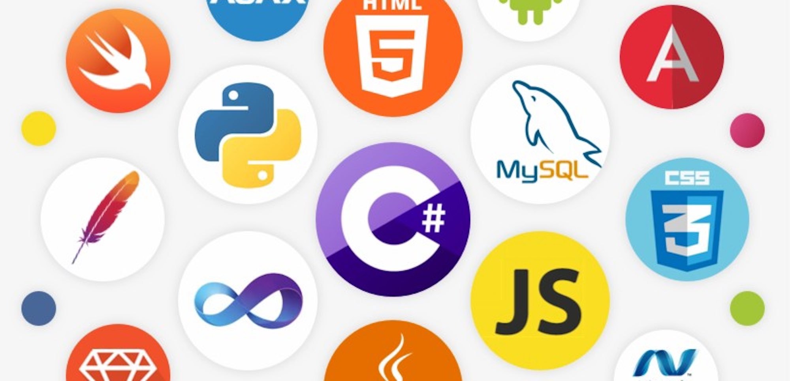

# Coding Challenges

## Table of Contents
- [Platforms](#platforms)
- [Languages Used](#languages-used)
- [Author](#author)

### Platforms
- [Codedex](https://www.codedex.io/)
- [CodeWars](https://www.codewars.com/)
- [LeetCode](https://leetcode.com/)
- [Practise Python](https://www.practicepython.org/)
- [Project Euler](https://projecteuler.net/)
- [PYative](https://pynative.com/)
- [W3 Resource](https://www.w3resource.com/)

### Languages Used
- C
- HTML / CSS
- JavaScript
- Python

### Author
- Tafara Nyamhunga - [Github](https://github.com/tafara-n)
